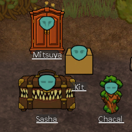
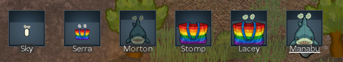

# Known Issues

## Feature - Not an Issue

- Some Storageborn can't use guns/weapons. Most likely ones from the neolithic/medieval eras. I based it on if they have "natural" weapons with their bodies. I was going to make it more widespread but then a cardboard box with an autopistol saved my colony.
- Storageborn can't use clothing/armour. Their bodies don't follow the Rimworld body system, so apparel won't fit them. They were given natural armour and vacuum genes to compensate.
- Storageborn sleep on top of the bedsheets. This is a workaround for bed sleeping animation hiding the body and only showing the head.
- Adding the storageborn race gene changes the xenotype to omw_storageborn. This was done on purpose to handle scenarios where pawn may get random genes and to handle "hybrid" babies.

## Known Issues - Maybe Fix

None so far.

## Known Issues - Won't Fix

Things I know don't work properly but I don't think are worth the effort to fix.

- Extra carrying capacity doesn't do much without other mods like "Pick Up and Haul" and "OgreStack". Changing how carrying capacity works is out of scope, and I want the end user to have the flexibility to pick the hauling mod that works for them.
- Big & Small "no blood" gene still allows for blood spots to appear on the wounded.
- Baby storageborn wear onesies. I add "very fast maturity" gene so we don't have to look at this horror for too long.
- Big & Small allows for a bunch of ideology hats to bypass "can't wear armor" gene. Changing it seems like it would cause more problems than just changing the clothing assignments. Remove hats from your Ideology to workaround it.
- Ideology hat equiping loop? Seems to be an interaction between the Big & Small genes and the default "Nudity" assignment rules allowing hats.
- Blindness meme no eyes looks weird.

